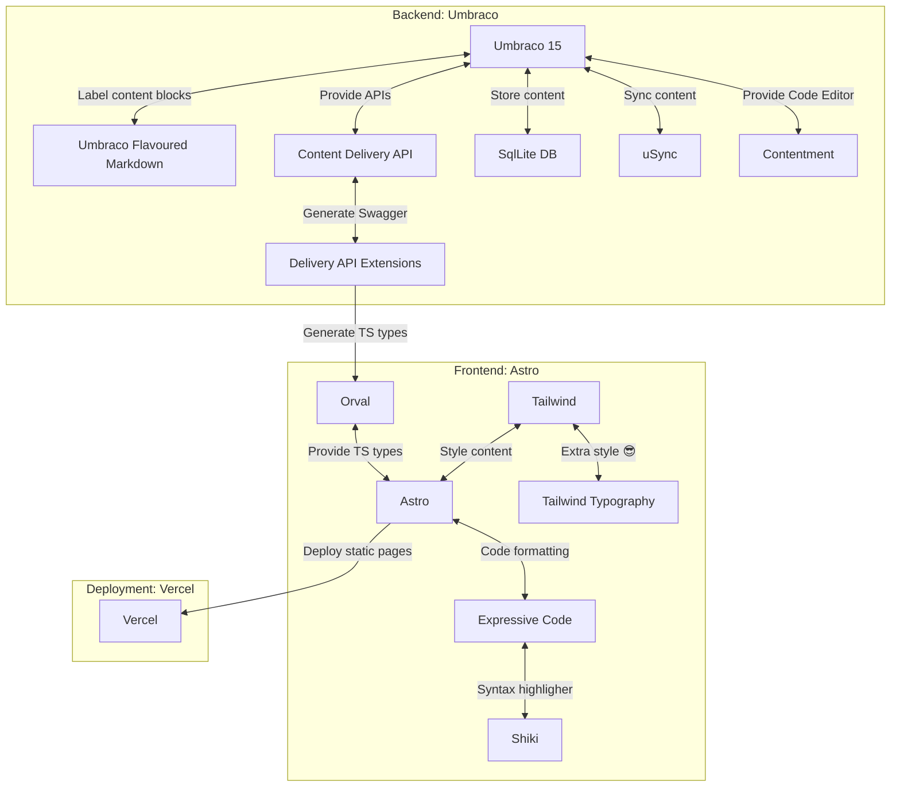

```mermaid
  flowchart TD
    Umb[Umbraco 15]
    UFM[Umbraco Flavoured Markdown]
    CDA[Content Delivery API]
    DAE[Delivery API Extensions]
    SQL[SqlLite DB]
    uSy[uSync]
    Ctt[Contentment]

    Ovl[Orval]
    Ast[Astro]
    Twd[Tailwind]
    TwdTyp[Tailwind Typography]
    ExC[Expressive Code]
    Shk[Shiki]

    Vcl[Vercel]

    subgraph "Backend: Umbraco"
        Umb<--Sync content-->uSy
        Umb<--Provide Code Editor -->Ctt
        Umb<--Store content -->SQL
        Umb<--Provide APIs -->CDA
        Umb<--Label content blocks-->UFM
        CDA<--Generate Swagger-->DAE
    end
    
    subgraph "Frontend: Astro"
        DAE--Generate TS types-->Ovl
        Ovl<--Provide TS types-->Ast
        Twd<--Style content-->Ast
        Twd<--Extra style 😎-->TwdTyp
        Ast<--Code formatting-->ExC
        ExC<--Syntax highligher-->Shk
    end
  
    subgraph "Deployment: Vercel"
        Ast--Deploy static pages-->Vcl
    end
```
